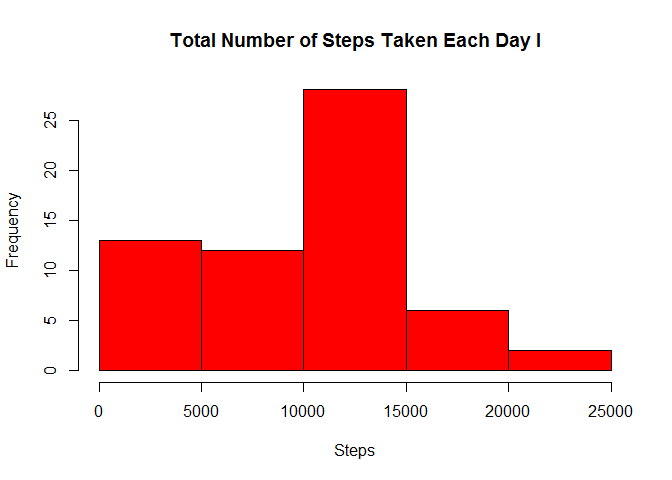
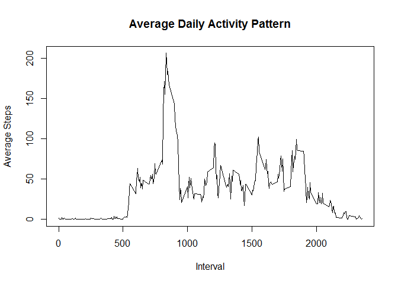
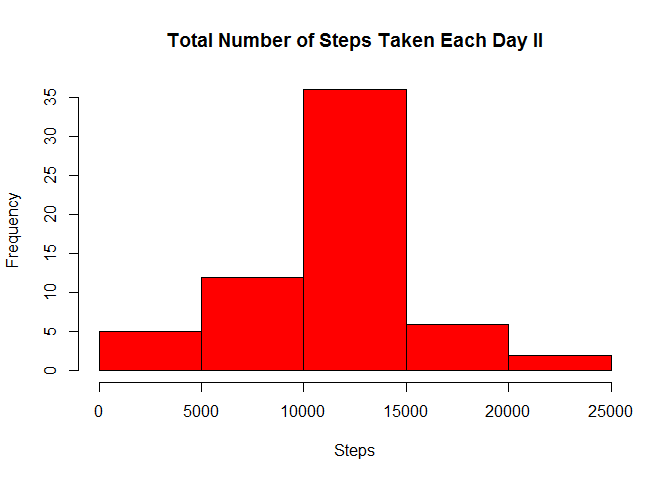
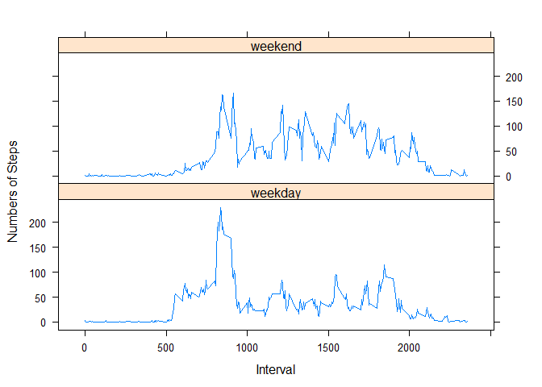

# Reproducible Research: Peer Assessment 1


## Loading and preprocessing the data

```r
data <- read.csv("activity.csv", colClasses = c("numeric", "Date", "integer"))
```
Let us have a look of the whole dataset. 
First, the head of the dataset.

```r
head(data)
```

```
##   steps       date interval
## 1    NA 2012-10-01        0
## 2    NA 2012-10-01        5
## 3    NA 2012-10-01       10
## 4    NA 2012-10-01       15
## 5    NA 2012-10-01       20
## 6    NA 2012-10-01       25
```
Then the tail of the dataset. Here we get the length of the data frame. 

```r
tail(data)
```

```
##       steps       date interval
## 17563    NA 2012-11-30     2330
## 17564    NA 2012-11-30     2335
## 17565    NA 2012-11-30     2340
## 17566    NA 2012-11-30     2345
## 17567    NA 2012-11-30     2350
## 17568    NA 2012-11-30     2355
```

## What is mean total number of steps taken per day?
Each day has (24*60/5) rows of data. And we already know that the dataset is ordered. 

```r
totalSteps <- vector(mode = "integer", length = 17568/(24*60/5))
for(i in 1:length(totalSteps)){
  totalSteps[i] <- sum(data$steps[((i-1)*24*60/5+1):(i*24*60/5)], na.rm = TRUE)
}
hist(totalSteps, main = "Total Number of Steps Taken Each Day I", xlab="Steps", col = 498)
```

 
  
Now we can fetch the mean value and the median value from the totalSteps. 

```r
summary(totalSteps)
```

```
##    Min. 1st Qu.  Median    Mean 3rd Qu.    Max. 
##       0    6778   10400    9354   12810   21190
```

## What is the average daily activity pattern?
Use the `subset()` to fetch the data of each interval.

```r
avgDaily <- data.frame(data$interval[1:(24*60/5)], vector(mode = "numeric", length= 24*60/5))
names(avgDaily) <- c("interval", "steps")
for(i in 1:(24*60/5)){
  data2 <- subset(data, interval == data$interval[i], select = steps)
  avgDaily$steps[i] <- mean(data2$steps ,na.rm = TRUE)
}
with(avgDaily, plot(steps ~ interval, type = "l", main = "Average Daily Activity Pattern", xlab = "Interval", ylab = "Average Steps"))
```

 
  
Use the `max()` to fetch the maximum value of the steps. Then find the row with the `subset()`. 

```r
subset(avgDaily, steps == max(avgDaily$steps))
```

```
##     interval    steps
## 104      835 206.1698
```

## Imputing missing values
Calculate the total number of NAs.

```r
sum(is.na(data$steps))
```

```
## [1] 2304
```
Fill in the missing values using the mean value with that 5-minute interval. Create a new dataset called newdata.

```r
newdata <- data
for(i in 1:length(newdata$steps)){
  if(is.na(newdata$steps[i])){
    data2 <- subset(avgDaily, interval == newdata$interval[i], select = steps)
    newdata$steps[i] <- data2$steps[1]
  }
}
```
Draw a new histogram of the total number of steps taken each day.

```r
totalSteps2 <- vector(mode = "integer", length = 17568/(24*60/5))
for(i in 1:length(totalSteps2)){
  totalSteps2[i] <- sum(newdata$steps[((i-1)*24*60/5+1):(i*24*60/5)], na.rm = TRUE)
}
hist(totalSteps2, main = "Total Number of Steps Taken Each Day II", xlab="Steps", col = 498)
```

 
  
Now calculate the mean value and the median value of the new dataset.

```r
summary(totalSteps2)
```

```
##    Min. 1st Qu.  Median    Mean 3rd Qu.    Max. 
##      41    9819   10770   10770   12810   21190
```

## Are there differences in activity patterns between weekdays and weekends?
We use the `lattice` package to draw the panel plot. 
First, use `weekdays()` to get the weekday value of each day, create a new dataset called weekdata and view the levels of weekdays.

```r
library(lattice)
weekdata <- cbind(newdata, "weekdays" = weekdays(newdata$date))
levels(weekdata$weekdays)
```

```
## [1] "星期二" "星期六" "星期日" "星期三" "星期四" "星期五" "星期一"
```
Then change the assignments of the levels.

```r
levels(weekdata$weekdays) <- c("weekday", "weekend", "weekend", "weekday", "weekday", "weekday", "weekday")
```
Now we can subset the values of steps according to the different two levels of the weekdays. Calculate the mean values and draw the panel plot.

```r
avgWeekdays <- data.frame("weekdays" = weekdata$weekdays[1:(24*60/5*2)], "interval" = data$interval[1:(24*60/5*2)], "steps" = vector(mode = "numeric", length = 24*60/5))
for(i in 1:(24*60/5)){
  avgWeekdays$weekdays[i] <- "weekday"
  data2 <- subset(weekdata, weekdays == "weekday" & interval == avgWeekdays$interval[i],select = steps)
  avgWeekdays$steps[i] <- mean(data2$steps)
}
for(i in 1:(24*60/5)){
  avgWeekdays$weekdays[i+24*60/5] <- "weekend"
  data2 <- subset(weekdata, weekdays == "weekend" & interval == avgWeekdays$interval[i+24*60/5],select = steps)
  avgWeekdays$steps[i+24*60/5] <- mean(data2$steps)
}
avgWeekdays <- transform(avgWeekdays, weekdays)
xyplot(steps ~ interval|weekdays, data = avgWeekdays, layout = c(1, 2), type = "l", xlab = "Interval", ylab = "Numbers of Steps")
```

 
